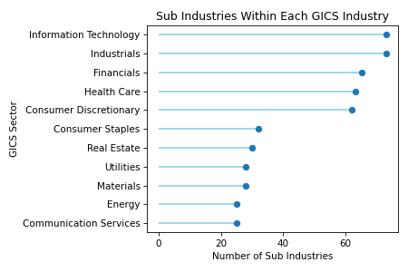
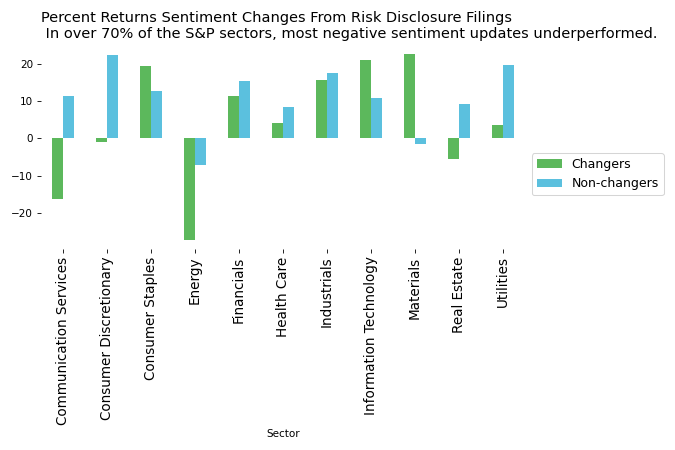

# Alpha Factors and NLP Analysis in the Equity Markets
Applying NLP framework to study intrinsic risk associated with 10K filings risk disclosures from S&amp;P500 companies. 

### Overview

* Scraping 10-K filings for equity return alpha and applying an NLP framework to study intrinsic risk associated with volatility in corporate risk disclosures,
* In each 10K annual filing, companies include information about the most significant risks that apply to the company or to its securities.
* Firms were mandated by the SEC to report information such as “Risk Factors” in their 10-K and detailed insection Item 1A. 
* Risks highlighted from year to year include both business and market-related nature.  Items found in this section could highlight broader market risk as well as its unsystematic risk.
* The respective financial statements are scrapped for financial terms and analyzed for sentiment.
* The sentiment is placed into a list using a bag of words approach and analyzed for the yearly delta in the "negative" term frequency as found in it's annual 10K filings.
* The relative change in a firms' “riskiness” of its business and/or industry is calculated as the % change in the negative language(as per financial dictionaries applied from University research settings).  
* This analysis utilized research in textual analysis for financial applications and data provided by the Accounting and Finance dept at the University of Notre Dame.  
* In this analysis, I reviewed the S&P 500 companies and sought to uncover unique risk profiles for each company and its respective GICS sector. 
* The end-use is designed to provide alpha application by assessing intrinsic risk, some of which may be underappreciated by the market.  
* In further analysis, I will look to see where this can add value as a factor in pricing options, particularly in comparing implied vols and historic volatility.

### Code and Resources Used
Python Version: 3.7  
Environment: Google Colab, Atom IDE, Jupyter notebook 

Packages: pandas, numpy, statsmodels, sklearn, matplotlib, keras  

### Data Cleaning
* 

### EDA
Below are a few highlights:

.png)

### Model Building

### Model Performance

